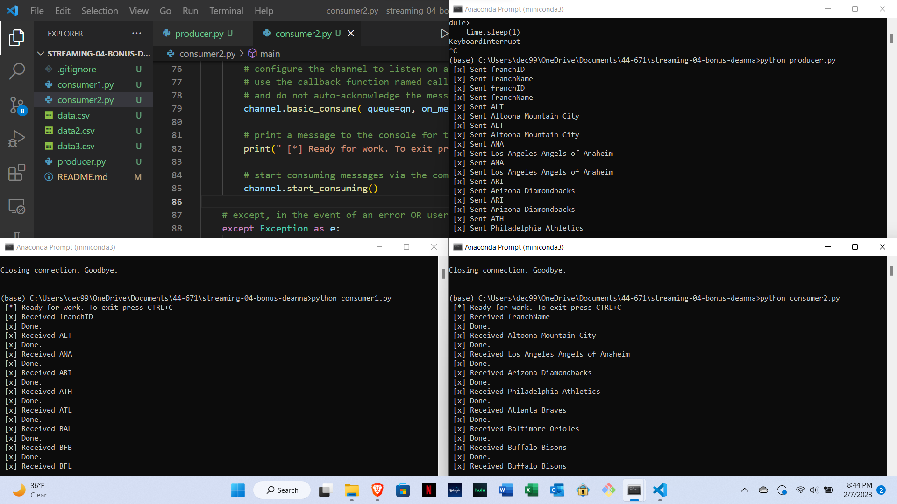

# streaming-04-bonus-deanna

Deanna Clayton

One process will read task messages from a csv file. Two worker processes will each receive a column from the original csv file, transform the message by either making the text all uppercase or lowercase, and then write the original and new message to another file. 

For this project, I had one producer and two consumer files opened to emit and receive the messages.

## Reference

- [RabbitMQ Tutorial - Work Queues](https://www.rabbitmq.com/tutorials/tutorial-two-python.html)

## Screenshot

See a running example with at least 3 concurrent process windows here:

Screenshot of terminals
